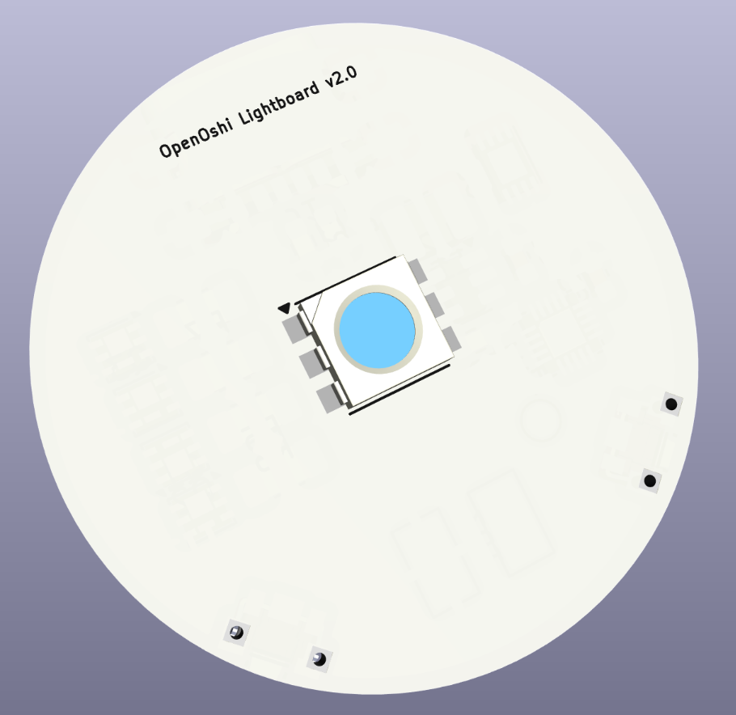
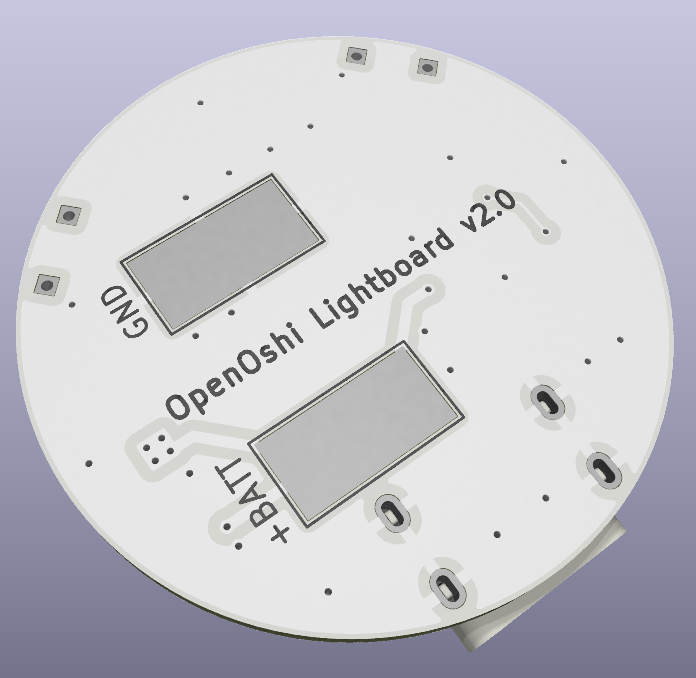

# OpenOshi
A fully open-source, DIY concert penlight. (v2.0 WIP)

Whether in the midst of the crowd at Belluna Dome or sitting in the dark in your bedroom, cheer on your favorite idols with this powerful, fully customizable penlight. It runs off of a single lithium battery and charges via USB-C to shine bright for hours of your favorite performances.

Best of all, it costs **less than $10 to make!** Total! That includes the PCB, the components, the battery, and the handle and tube! All while being fully hackable and modifiable. Manufacture in quantity and see how many you can hold in one hand: a classic idolfan challenge. 

OpenOshi is open-source hardware under the CERN Open Hardware Licence (strongly reciprocal).

This project consists of:
- a 3D-printable handle and screw-in translucent blade
- the Lightboard: a central PCB with an RGBW LED, a CH32V003F4U6 microcontroller, buttons and a USB-C charging port
- software to easily add your favorite idols' colors to the Lightboard

**Building tips**
- For printing the handle, I suggest a neutral color of PLA filament, and for the tube, transparent PETG printed at 100% rectilinear infill.
- The PCB is made to OSH Park 2-layer specifications and tolerances as of April 2025. Modify if needed to meet your preferred PCB supplier's capabilities.
- Control software for the CH32V003 written in C is provided, and can be compiled and flashed to the board with a single wire using the programming pad on the bottom. Note: you will need a WCH-Link programmer or equivalent.

