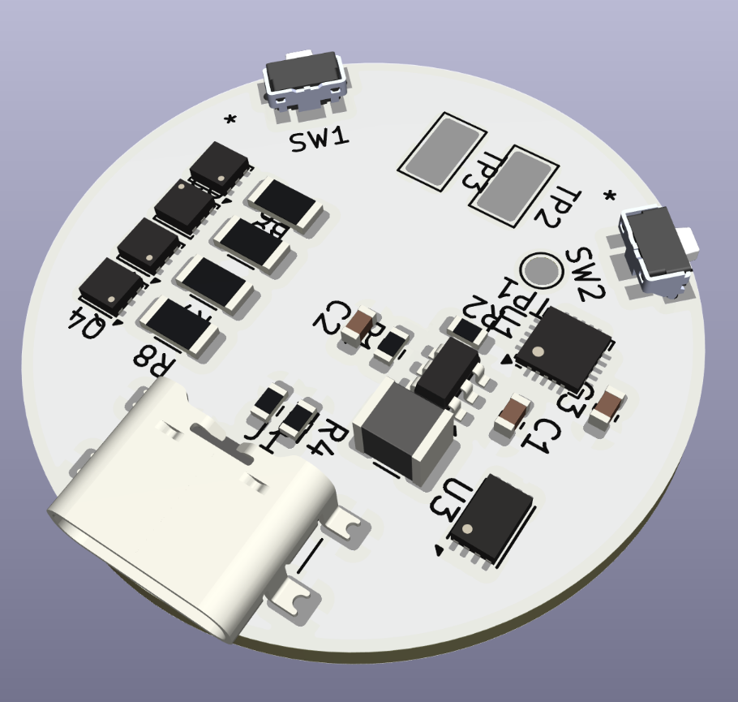

# OpenOshi
A fully open-source, DIY concert penlight. (v2.0)

Whether in the midst of the crowd at Belluna Dome or sitting in the dark in your bedroom, cheer on your favorite idols with this powerful, fully customizable penlight. It runs off of a single lithium battery and charges via USB-C to shine bright for hours of your favorite performances.

Best of all, it costs **less than $10 to make!** Total! That includes the PCB, the components, the battery, and the handle and tube! All while being fully hackable and modifiable. Manufacture in quantity and see how many you can hold in one hand: a classic idolfan challenge. 

This project consists of:
- a 3D-printable handle and screw-in translucent blade
- the Lightboard: a central PCB with an RGBW LED, a CH32V003F4U6 microcontroller, buttons and a USB-C charging port
- software to easily add your favorite idols' colors to your Lightboard

OpenOshi's electrical and mechanical components are open-source hardware licensed under CERN-OHL-S-2.0 (see the root `LICENSE` file). The firmware is open-source software licensed under the MIT License (see `firmware/LICENSE`). The `ch32fun` SDK included as a submodule of the firmware remains under its own MIT License; refer to the submodule's `LICENSE` file.

**Building tips**
- For printing the handle, I suggest a neutral color of PLA filament, and for the tube, transparent PETG printed at 100% rectilinear infill.
- The PCB is made to JLCPCB 2-layer specifications and tolerances as of July 2025. Modify if needed to meet your preferred PCB supplier's capabilities.
- The control firmware can be flashed to the board with a single wire using the SWIO programming pad on the top. To do so, you will need a WCH-Link programmer or equivalent and a flashing tool; [`ch32fun`](https://github.com/cnlohr/ch32fun) names several good open-source options like the `esp32s2-funprog` for the former, and it implements the `minichlink` tool for the latter.

